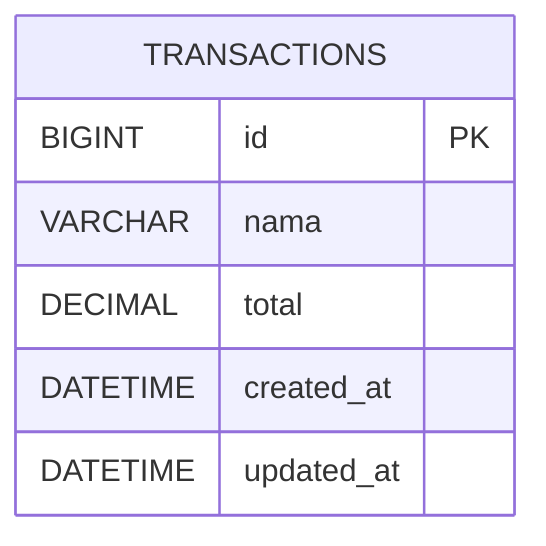

# 03 — Fondasi Database dan MySQL

Bagian ini mendampingi halaman 16–28 modul. Database adalah sistem untuk
menyimpan dan mengelola data terstruktur agar tetap ada, dapat dicari, diubah,
dan digunakan kembali. MySQL berjalan sebagai server; aplikasi berkomunikasi
dengannya melalui connector.

## Peta istilah latihan

```text
MySQL Server
└── Database: raincode_expense
    └── Table/entity: transactions
        ├── Column: id, nama, total, created_at, updated_at
        └── Row: satu transaksi, misalnya Kopi Susu — 25000
```

| Istilah | Makna pada latihan |
|---|---|
| Entity | Konsep yang disimpan: transaksi |
| Database | Container bernama `raincode_expense` |
| Table | Kumpulan row sejenis bernama `transactions` |
| Column/field | Atribut yang dimiliki semua row |
| Datatype | Aturan nilai, misalnya `VARCHAR`, `DECIMAL`, `DATETIME` |
| Row | Satu record transaksi |
| Primary key | `id` unik untuk menunjuk tepat satu row |

## Dari kebutuhan menjadi schema

Sebelum menulis SQL, tentukan data yang harus bertahan, entity, atribut wajib,
tipe data, identifier unik, serta kemungkinan relasi. Pada sistem lebih besar,
hasilnya dapat ditulis sebagai ERD dan data dictionary. Latihan ini sengaja
memakai satu entity agar hubungan konsep dan query tetap terlihat.



`DECIMAL(15,2)` dipakai untuk uang karena menyimpan dua digit desimal secara
tepat. `VARCHAR(100)` membatasi nama dan `id` memakai auto increment.

## Praktik SQL langsung

1. Jalankan `01-schema.sql` satu kali melalui Workbench atau MySQL client.
2. Jalankan `02-crud.sql` satu per satu.
3. Sebelum tiap query, minta peserta memprediksi perubahan row.
4. Setelah query, gunakan `SELECT` untuk membuktikan perubahan.
5. Tekankan bahwa `UPDATE` dan `DELETE` memerlukan `WHERE` yang benar.

Sampai titik ini aplikasi belum berbicara dengan database. Peserta baru menjadi
manusia yang mengirim query langsung. Bagian berikutnya memberi kemampuan itu
kepada Python.

